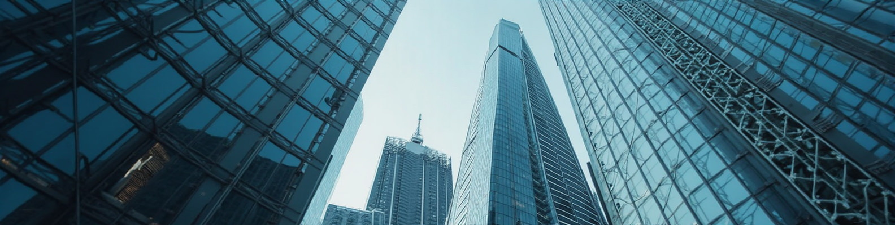

# 🎨 LinkedIn Cover Images

A collection of free LinkedIn cover/background images for anyone to use! 🚀

## 📖 About

This repository contains 164 LinkedIn cover images that are completely free to use. I created all of these images myself and am making them available to help make LinkedIn profiles more visually appealing. ✨

## 🖼️ Sample Images

Here are a few examples from the collection:

  
  
  

  
  
  

## 🎯 Usage

Feel free to:
- 📥 Download any image from the `jpg/` folder
- 🖼️ Use them as your LinkedIn background/cover image
- 🤝 Share with others who might find them useful

No attribution required, though always appreciated! 💙

## 📝 How to Update Your LinkedIn Background

1. 👤 Go to your LinkedIn profile
2. 📷 Click on the camera icon in your cover photo area
3. 📤 Select "Upload photo"
4. 🎨 Choose any image from this collection
5. 🔧 Adjust positioning if needed
6. ✅ Save changes

A good LinkedIn background helps your profile stand out and makes the professional world a little more colorful! 🌈

## ⚖️ Disclaimer

These images are provided "as is" without warranty of any kind. While I created all images in this collection and they should be free of any copyright issues, I assume no responsibility for their use.

## 🔗 Connect

Created by [Richard Young, Ph.D.](https://www.linkedin.com/in/richard-j-young/)  
🧠 Machine Learning & NLP Scientist | Conversational AI Specialist

---

*Making the world a little better place, one LinkedIn background at a time.* 🌍✨